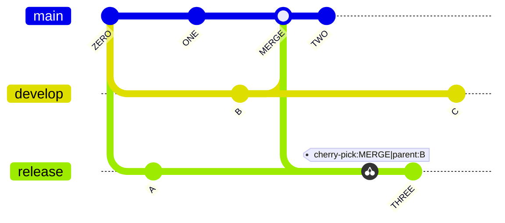

## Using Branches

### Using branches locally

```sh
git branch
```

If you type `git branch` you will see a list of local branches.

```sh
git branch --all
git branch -a
```

If you want to see all the branches, including the read-only copies of your remote branches, you can add the `--all` option or just `-a`.

> The `--all` and `-a` are actually synonyms for the branch command. Git often provides a verbose and a short option.

### Switching branches

```sh
git switch <BRANCH-NAME>
```

To switch the branch you created online, type `git switch` and the name of your branch. Git will provide a message that says you have been switched to the branch, and it has been set up to track the same remote branch from origin.

> You do not need to type `remotes/origin` in front of the branch - only the branch name. Typing `remotes/origin` in front of the branch name will put you in a detached HEAD state. We will learn more about that later, but for now just remember this is not a state we want to be in.

