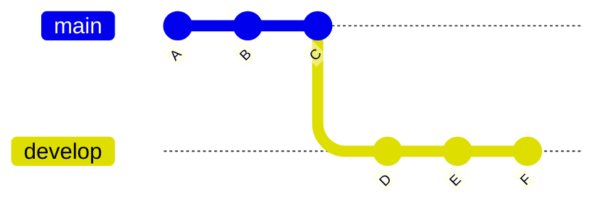

## What is a Branch?

A Git branch represents an independent line of development within a project. Branches are lightweight, movable pointers to a specific commit, allowing developers to diverge from the main line of development and work on new features or bug fixes without affecting the main codebase. 

When the work on a branch is complete, it can be merged back into the main branch, integrating the changes made.

**What is a branch?**: A _[branch](https://docs.github.com/en/get-started/quickstart/github-glossary#branch)_ is a parallel version of your repository. By default, your repository has one branch named `main` and it is considered to be the definitive branch. Creating additional branches allows you to copy the `main` branch of your repository and safely make any changes without disrupting the main project. Many people use branches to work on specific features without affecting any other parts of the project.

Branches allow you to separate your work from the `main` branch. In other words, everyone's work is safe while you contribute. For more information, see "[About branches](https://docs.github.com/en/pull-requests/collaborating-with-pull-requests/proposing-changes-to-your-work-with-pull-requests/about-branches)".

### Using branches locally

```sh
git branch
```



If you type `git branch` you will see a list of local branches.

```sh
git branch --all
git branch -a
```

If you want to see all the branches, including the read-only copies of your remote branches, you can add the `--all` option or just `-a`.

> The `--all` and `-a` are actually synonyms for the branch command. Git often provides a verbose and a short option.

### Switching branches

```sh
git switch <BRANCH-NAME>
```

To switch the branch you created online, type `git switch` and the name of your branch. Git will provide a message that says you have been switched to the branch, and it has been set up to track the same remote branch from origin.

> You do not need to type `remotes/origin` in front of the branch - only the branch name. Typing `remotes/origin` in front of the branch name will put you in a detached HEAD state. We will learn more about that later, but for now just remember this is not a state we want to be in.
