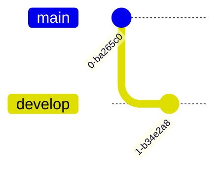

## What is a Branch?

A Git branch represents an independent line of development within a project. Branches are lightweight, movable pointers to a specific commit, allowing developers to diverge from the main line of development and work on new features or bug fixes without affecting the main codebase. 

### Viewing Branches

Type `git branch` to see a list of local branches.

```sh
git branch
* main
```

Type `git branch --all` to see all the branches, including the read-only copies of your remote branches (you can add the `--all` option or just `-a`).

```sh
git branch --all
* main
  remotes/origin/HEAD -> origin/main
  remotes/origin/main
```


> The `--all` and `-a` are actually synonyms for the branch command. Git often provides a verbose and a short option.

### Creating branches

Type `git branch <name>` to create a new branch.

```sh
git branch develop
* main
```



### Switching branches

```sh
git switch <BRANCH-NAME>
```

To switch the branch you created online, type `git switch` and the name of your branch. Git will provide a message that says you have been switched to the branch, and it has been set up to track the same remote branch from origin.

> You do not need to type `remotes/origin` in front of the branch - only the branch name. Typing `remotes/origin` in front of the branch name will put you in a detached HEAD state. We will learn more about that later, but for now just remember this is not a state we want to be in.

### Merging Branches

- `git merge`
- `git rebase`
- `git rebase -i`