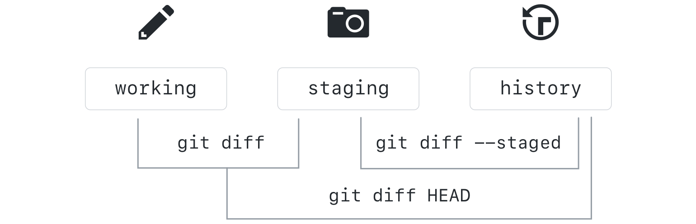
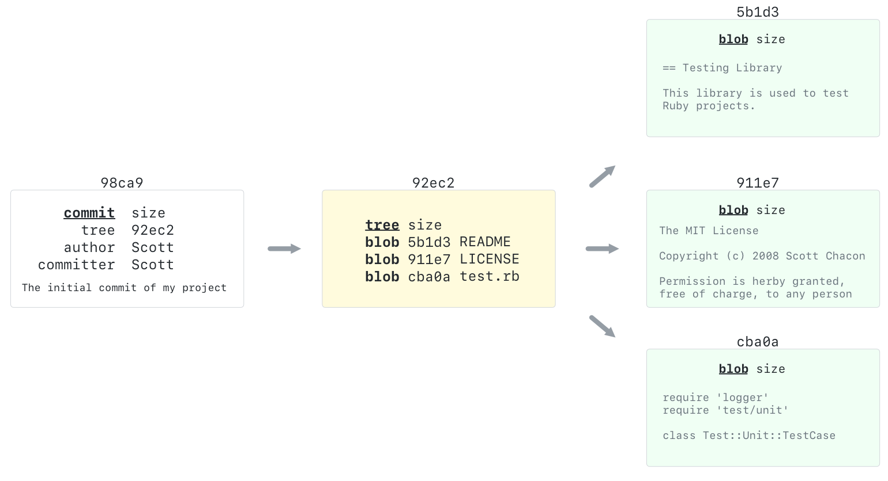
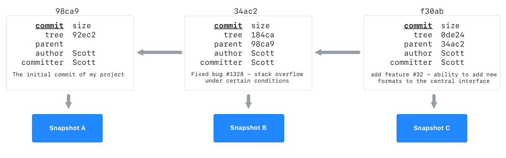

## What is a Commit?

A Git commit is a core function in Git that captures a snapshot of the changes made to the files in a project at a specific point in time. This operation sends the latest changes of the source code to the local repository, making these changes part of the head revision of the repository.

### The two stage commit

When you work locally, your files exist in one of four states. They are either untracked, modified, staged, or committed.


An untracked file is a new file that has never been committed.

Git tracks these files, and keeps track of your history by organizing your files and changes in three working trees. They are Working, Staging (also called Index), and History. When we are actively making changes to files, this is happening in the working tree.


To add these files to version control, we use `git add`, which creates a collection of files that represent a discrete unit of work. We build this unit in the staging area.


When we are satisfied with the unit of work we have assembled, we create a commit using `git commit`, which will take a snapshot of everything in the staging area.


---

## Viewing local project history

In this section, you will discover commands for viewing the history of your project.

### Using Git log

When you clone a repository, you receive the history of all the commits made in that repository. The log command allows us to view that history on our local machine.

Let's take a look at some option switches you can use to customize your view of the project history. You can find these options, and many more, on [git-scm.com](https://git-scm.com/docs/git-log). _(Note: `--graph` is default on most Git Bash for Windows terminals.)_

```sh
git log
git log --oneline
git log --oneline --graph
git log --oneline --graph --decorate
git log --oneline --graph --decorate --all
git log --stat
git log --patch
```

> Use the up and down arrows or press enter to view additional log entries. Type `q` to quit viewing the log and return to the command prompt.

---

## Viewing local changes

Now that you have some files in the staging area and the working directory, let's explore how you can compare different points in your repository.

### Comparing changes within the repository

`git diff` allows you to see the difference between any two refs in the repository. The diagram below shows how you can compare the content of your working area, staging, and HEAD (or the most recent commit):



Let's try these commands on the repository:

```sh
git diff
git diff --staged
git diff HEAD
git diff --color-words
```

`git diff` will also allow you to compare between branches, commits, and tags by simply typing:

```sh
git diff <REF-1> <REF-2>
git diff main slow-down
git diff origin/main main
git diff 2710 b745
```

> Notice that, just like merges, diffs are directional. It is easiest to think of it as "diff back to `<REF-1>` starting at `<REF-2>`" or "see what is *not* in `<REF-1>` but *is* in `<REF-2>`".  The final example shows how to compare two commits based on their commit hashes.  This exact command will not work for everyone since the commits in your own repository will have different hashes.

There's a helpful alias for opening the remote directly from your command-line. Check out the appendix if you'd like to know more!

---

## Reverting commits

In this section, we will learn about commands that re-write history and understand when you should or shouldn't use them.

### How commits are made

Every commit in Git is a unique snapshot of the project at that point in time. It contains the following information:

- Pointers to the current objects in the repository
- Commit author and email (from your config settings)
- Commit date and time
- Commit message



Each commit also contains the commit ID of its parent commit.



Image source: ProGit v2 by Scott Chacon

### Safe operations

Git's data structure gives it integrity, but its distributed nature also requires us to be aware of how certain operations will impact the commits that have already been shared.

If an operation will change a commit ID that has been pushed to the remote (also known as a public commit), we must be careful in choosing the operations to perform.

#### Guidelines for common commands

| Command | Cautions |
| ------- | -------- |
| `revert`  | Generally safe since it creates a new commit.|
| `commit --amend` | Only use on local commits.
| `reset` | Only use on local commits.
| `cherry-pick` | Only use on local commits.
| `rebase` | Only use on local commits.

### Reverting a commit

To get your game working, you will need to reverse the commit that incorrectly renames `index.html`.

> **Warning**: Before you reverse the commit, it is a good idea to make sure you will not be inadvertently reversing other changes that were lumped into the same commit. To see what was changed in the commit, use `git show SHA`.

1. Initialize the revert: `git revert <SHA>`
1. Type a commit message.
1. Push your changes to GitHub.
