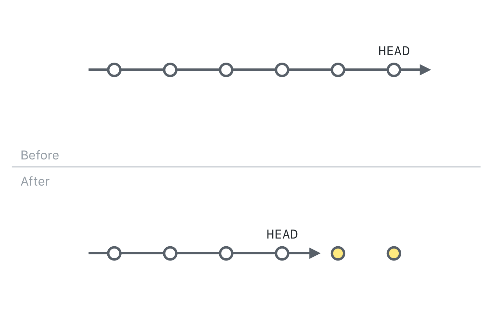
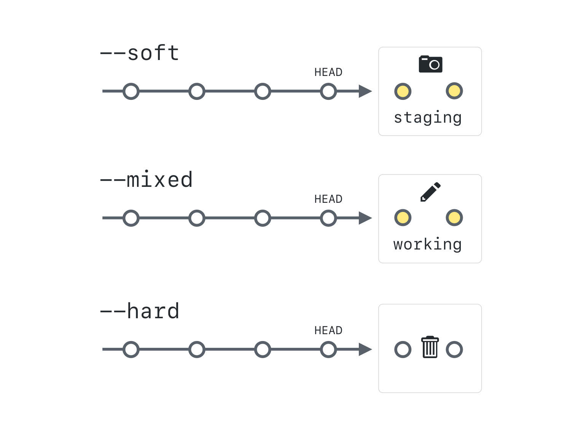

## What is a Commit?

A Git commit is a core function in Git that captures a snapshot of the changes made to the files in a project at a specific point in time. This operation sends the latest changes of the source code to the local repository, making these changes part of the head revision of the repository.

### The two stage commit

When you work locally, your files exist in one of four states. They are either untracked, modified, staged, or committed.


An untracked file is a new file that has never been committed.

Git tracks these files, and keeps track of your history by organizing your files and changes in three working trees. They are Working, Staging (also called Index), and History. When we are actively making changes to files, this is happening in the working tree.


To add these files to version control, we use `git add`, which creates a collection of files that represent a discrete unit of work. We build this unit in the staging area.


When we are satisfied with the unit of work we have assembled, we create a commit using `git commit`, which will take a snapshot of everything in the staging area.


---

## Viewing local project history

In this section, you will discover commands for viewing the history of your project.

### Using Git log

When you clone a repository, you receive the history of all the commits made in that repository. The log command allows us to view that history on our local machine.

Let's take a look at some option switches you can use to customize your view of the project history. You can find these options, and many more, on [git-scm.com](https://git-scm.com/docs/git-log). _(Note: `--graph` is default on most Git Bash for Windows terminals.)_

```sh
git log
git log --oneline
git log --oneline --graph
git log --oneline --graph --decorate
git log --oneline --graph --decorate --all
git log --stat
git log --patch
```

> Use the up and down arrows or press enter to view additional log entries. Type `q` to quit viewing the log and return to the command prompt.

---

## Viewing local changes

Now that you have some files in the staging area and the working directory, let's explore how you can compare different points in your repository.

### Comparing changes within the repository

`git diff` allows you to see the difference between any two refs in the repository. The diagram below shows how you can compare the content of your working area, staging, and HEAD (or the most recent commit):


Let's try these commands on the repository:

```sh
git diff
git diff --staged
git diff HEAD
git diff --color-words
```

`git diff` will also allow you to compare between branches, commits, and tags by simply typing:

```sh
git diff <REF-1> <REF-2>
git diff main slow-down
git diff origin/main main
git diff 2710 b745
```

> Notice that, just like merges, diffs are directional. It is easiest to think of it as "diff back to `<REF-1>` starting at `<REF-2>`" or "see what is *not* in `<REF-1>` but *is* in `<REF-2>`".  The final example shows how to compare two commits based on their commit hashes.  This exact command will not work for everyone since the commits in your own repository will have different hashes.

There's a helpful alias for opening the remote directly from your command-line. Check out the appendix if you'd like to know more!

---

## Fixing commit mistakes

In this activity, we will begin to explore some ways Git and GitHub can help us shape our project history.

### Revising your last commit

`git commit --amend` allows us to make changes to the commit that HEAD is currently pointing to. Two of the most common uses are:

- Re-writing commit messages
- Adding files to the commit

Let's see this in action:

1. Create a new file:
   - Bash: `touch file7.md`
   - PowerShell: `Out-File file7.md`
1. When you are adding files to the previous commit, they should be in the staging area. Move your file to the staging area: `git add file7.md`
1. `git commit --amend`
1. The text editor will open, allowing you to edit your commit message.

>You can actually amend any data stored by the last commit such as commit author, email, etc.


---

## Reverting commits

In this section, we will learn about commands that re-write history and understand when you should or shouldn't use them.

### How commits are made

Every commit in Git is a unique snapshot of the project at that point in time. It contains the following information:

- Pointers to the current objects in the repository
- Commit author and email (from your config settings)
- Commit date and time
- Commit message


Each commit also contains the commit ID of its parent commit.


Image source: ProGit v2 by Scott Chacon

### Safe operations

Git's data structure gives it integrity, but its distributed nature also requires us to be aware of how certain operations will impact the commits that have already been shared.

If an operation will change a commit ID that has been pushed to the remote (also known as a public commit), we must be careful in choosing the operations to perform.

#### Guidelines for common commands

| Command | Cautions |
| ------- | -------- |
| `revert`  | Generally safe since it creates a new commit.|
| `commit --amend` | Only use on local commits.
| `reset` | Only use on local commits.
| `cherry-pick` | Only use on local commits.
| `rebase` | Only use on local commits.

### Reverting a commit

To get your game working, you will need to reverse the commit that incorrectly renames `index.html`.

> **Warning**: Before you reverse the commit, it is a good idea to make sure you will not be inadvertently reversing other changes that were lumped into the same commit. To see what was changed in the commit, use `git show SHA`.

1. Initialize the revert: `git revert <SHA>`
1. Type a commit message.
1. Push your changes to GitHub.

---

## Rewriting history with Git reset

When you want to make changes to commits further back in history, you will need to use a more powerful command: `git reset`.

### Understanding Reset

Sometimes we are working on a branch, and we decide things aren't going quite like we had planned. We want to reset some, or even all, of our files to look like what they were at a different point in history.



Remember, there are three different snapshots of our project at any given time. The first is the most recent commit (also known as HEAD). The second is the staging area (also called the index). The third is the working directory containing any new, deleted, or modified files.

The `git reset` command has three modes, and they allow us to change some or all of these three snapshots.

It also helps to know what branches technically are: each is a pointer, or reference, to the latest commit in a line of work. As we add new commits, the currently checked-out branch "moves forward," so that it always points to the most recent commit.

### Reset modes



The three modes for git reset are: `--soft`, `--mixed`, and `--hard`. For these examples, assume that we have a "clean" working directory, i.e. there are no uncommitted changes.

#### `--soft`

`git reset --soft <SHA>` moves the current branch to point at the `<SHA>`. However, the working directory and staging area remain untouched. Since the snapshot that current branch points to now differs from the index's snapshot, this command effectively stages all differences between those snapshots. This is a good command to use when you have made numerous small commits, and you would like to regroup them into a single commit.

#### `--mixed`

`git reset --mixed <SHA>` makes the current branch *and* the staging area look like the `<SHA>` snapshot. *This is the default mode:* if you don't include a mode flag, Git will assume you want to do a `--mixed` reset. `--mixed` is useful if you want to keep all of your changes in the working directory, but change whether and how you commit those changes.

#### `--hard`

`git reset --hard <SHA>` is the most drastic option. With this, Git will make all 3 snapshots, the current branch, the staging area, *and* your working directory, look like they did at `<other-commit>`. This can be dangerous! We've assumed so far that our working directory is clean. If it is not, and you have uncommitted changes, `git reset --hard` will *delete all of those changes*. Even with a clean working directory, use `--hard` only if you're sure you want to completely undo earlier changes.

### Soft reset

Using the practice repository we created earlier, let's try a `reset --soft`.

1. View the history of our project: `git log --oneline --decorate`
1. Identify the current location of `HEAD`.
1. Go back two commits in history: `git reset --soft HEAD~2`
1. See the tip of our branch (and `HEAD`) is now sitting two commits earlier than it was before: `git log --oneline --decorate`
1. The changes we made in the last two commits should be in the staging area: `git status`
1. All the files still exist locally: `ls`
1. Let's remove the extra file we created earlier: `git rm --cached file7.md`
1. Now, we'll re-commit these changes without the extra file: `git commit -m "re-add file 5 and 6"`

> In this example, the tilde tells git we want to reset to two commits before the current location of `HEAD`. You can also use the first few characters of the commit ID to pinpoint the location where you would like to reset.

### Mixed reset

Next we will try the default mode of reset, `reset --mixed`:

1. Once again, we will start by viewing the history of our project: `git log --oneline`
1. Go back one commit in history: `git reset HEAD~`
1. See where the tip of the branch is pointing: `git log --oneline --decorate`
1. The changes we made in the last commit have been moved back to the working directory: `git status`
1. All the files still exist locally: `ls`
1. Move the files to the staging area before we can commit them: `git add file5.md file6.md`
1. Re-commit the files: `git commit -m "re-add file 5 and 6"`

> Notice that although we have essentially made the exact same commit (adding file 5 and 6 together with the same HEAD and commit message) we still get a new commit ID. This can help us see why the reset command should never be used on commits that have been pushed to the remote.

### Hard reset

Last but not least, let's try a hard reset.

1. Start by viewing the history of our project with: `git log --oneline`
1. Reset to the point in time when the only file that existed was the README.md: `git reset --hard <SHA>`
1. See that all the commits are gone: `git log --oneline`
1. Notice your working directory is clean: `git status`
1. See that the only files in your repository are the README.md and file7.md: `ls`

> **Warning:** Remember, `git reset --hard` overwrites your working directory, staging area, and history. This means that uncommitted changes you have made to your files will be completely lost. Don't use it unless you really want to discard your changes. Any files that are untracked will remain and be unchanged.

### Does 'gone' really mean gone?

The answer: It depends!

```sh
git reflog
```

The reflog is a record of every place HEAD has been. In a few minutes we will see how the reflog can be helpful in allowing us to restore previously committed changes. But first, we need to be aware of some of the reflog's limitations:

- **The reflog is only local.** It is not pushed to the remote and only includes your local history. In other words, you can't see the reflog for someone else's commits, and they can't see yours.
- **The reflog is a limited time offer.** By default, reachable commits are displayed in the reflog for 90 days, but unreachable commits (meaning commits that are not attached to a branch) are only displayed for 30 days.

> Sometimes, you'll want to save your work in a commit without having to think of a commit message, or before you're ready to organize your changes. If that's the case, you can create aliases to create "save points". See the appendix with aliases to learn how!
