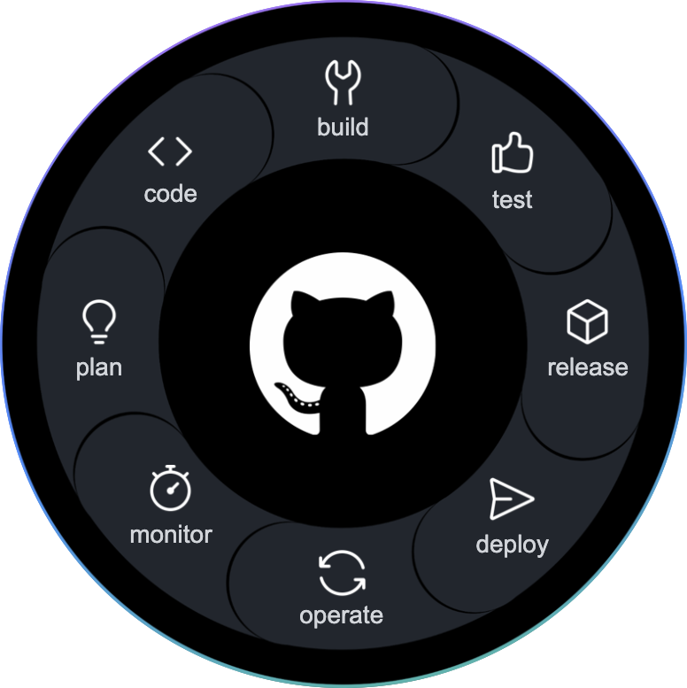

## What is GitHub?

<!--  -->

  

- Technology platform built on top of **Git**
- **Social** side of Git
- **Code hosting** and **collaboration** platform
- **Community** of developers
- **Ecosystem** of integrations
- **Team** collaboration through:
  - **Issues**
  - **Pull requests**
  - **Organisation and teams**
  - **Projects**

