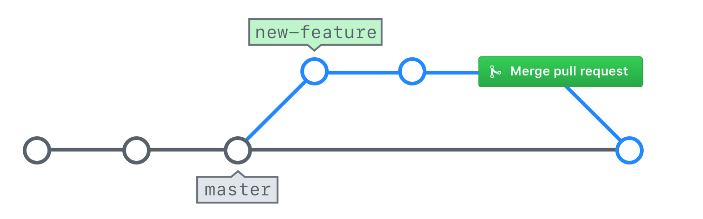

## What is a Pull Request?

Pull Requests are used to propose changes to the project files. A pull request introduces an action that addresses an Issue. A Pull Request is considered a "work in progress" until it is merged into the project.

[include](07a_activity_create_pull_request.md ':include')

### Exploring a pull request

Now that we have created a Pull Request, let's explore a few of the features that make Pull Requests the center of collaboration:

#### ![octicon-comment-discussion] Conversation tab

Similar to the discussion thread on an Issue, a Pull Request contains a discussion about the changes being made to the repository. This discussion is found in the **Conversation** tab and also includes a record of all the commits made on the branch as well as assignments, labels and reviews that have been applied to the pull request.

#### ![octicon-git-commit] Commits tab

The **Commits** tab contains more detailed information about who has made changes to the files. Clicking each commit ID will allow you to see the changes applied in that specific commit.

#### ![octicon-diff] Files changed tab

The **Files changed** tab allows you to see cumulative effect of all the changes made on the branch. We call this the `diff`. Our diff isn't very interesting yet, but as we make changes your diff will become very colorful.

### Code review in pull requests

To provide feedback on proposed changes, GitHub offers three levels of commenting:

#### General conversation

You can provide general comments on the Pull Request within the **Conversation** tab.

#### Line comments

In the **Files changed** tab, you can hover over a line to see a blue ![`+`][octicon-diff-added] icon. Clicking this icon will allow you to enter a comment on a specific line. These line level comments are a great way to give additional context on recommended changes. They will also be displayed in the **Conversation** tab.

#### Review

When you are making line comments, you can also choose to **Start a Review**. When you create a review, you can group many line comments together with a general message: Comments, Approve, or Request Changes. Reviews have special power in GitHub when used in conjunction with protected branches.

### Activity: Code review

One of the best ways to ensure code quality is to make peer reviews a part of every Pull Request. Let's review your partner's code now:

1. Click the **Pull Request** tab.
1. Use the **Author** drop down to locate your partner's pull request.
1. Click the **Files Changed** tab.
1. Hover over a single line in the file to see the blue +. Click the + to add a line comment.
1. Comment on the line and click **Start a review**.
1. Add additional line comments to the pull request.
1. Click **Review changes** in the top right corner.
1. Choose whether to **Approve** or **Request changes**
1. Enter a general comment for the review.
1. Click **Submit review**
1. Click the **Conversation** tab to check out your completed review.

[octicon-comment-discussion]:https://unpkg.com/octicons/build/svg/comment-discussion.svg

[octicon-diff]:https://unpkg.com/octicons/build/svg/diff.svg

[octicon-diff-added]: https://unpkg.com/octicons/build/svg/diff-added.svg

[octicon-git-commit]:https://unpkg.com/octicons/build/svg/git-commit.svg

---

## Merging pull requests

Now that you have made the requested changes, your pull request should be ready to merge.

### Merge explained

When you merge your branch, you are taking the content and history from your feature branch and adding it to the content and history of the `main` branch.

Many project teams have established rules about who should merge a pull request.

- Some say it should be the person who created the pull request since they will be the ones to deal with any issues resulting from the merge.
- Others say it should be a single person within the project team to ensure consistency.
- Still others say it can be anyone other than the person who created the pull request to ensure at least one review has taken place.

This is a discussion you should have with the other members of your team.

### Merging your pull request

Let's take a look at how you can merge the pull request:

1. Navigate to your Pull Request

   ?> **Hint:** Use the Author or Assignee drop-downs to find your pull request quickly

1. Click **Conversation**
1. Scroll to the bottom of the Pull Request and click the **Merge pull request** button
1. Click **Confirm merge**
1. Click **Delete branch**
1. Click **Issues** and confirm your original issue has been closed

GitHub offers three different merge strategies for pull requests:

- **Create a merge commit**

  This is the traditional option that will perform a standard recursive merge. A new commit will be added that shows the point when the two branches were merged together.

- **Squash and merge**

  This option will take all the commits on your branch and compress them into a single commit. The commit messages will be preserved in the extended commit message for the commit, but the individual commits will be lost.

- **Rebase and merge**

  This option will take all the commits and replay them as if they just happened. This allows GitHub to perform a fast-forward merge (and avoids the addition of the merge commit).
