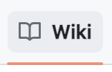

# What is a Repository?

A repository is the most basic element of GitHub. It is easiest to imagine as a project's folder. However, unlike an ordinary folder on your laptop, a GitHub repository offers simple yet powerful tools for collaborating with others.

Location where GitHub displays the files included in the repository. GitHub also displays an About section, the most recent commit in history and the current working branch (there could be more to display as well depending on repository settings).

Tickets to track bugs and feature requests. Issues can be assigned to specific team members and are designed to encourage discussion and collaboration.

Pull requests represent a change, such as adding, modifying, or deleting files, which the author would like to make to files on the repository. Pull Requests enable collaboration through conversations and pull request reviews.

Kanban style boards that all you to visualize your work. Projects can be created at the repository or organization level.

Wikis are to communicate project details, display user documentation, or almost anything your heart desires. GitHub utilizes git to help keep track of the edits to the Wiki in version control.

## Files to keep in Your GitHub Repository as a best practice:

- **README.md**
    - File that should live in your repositories contents. GitHub looks for this file and helpfully displays it below the repository. The README can explain the project and point readers to helpful information within the project.
- **CONTRIBUTING.md**
    - File that describes the process for collaboration on a repository. A link to the CONTRIBUTING.md file is shown when a user attempts to create a new issue or pull request.
- **ISSUE_TEMPLATE.md**
    - File (and its twin the pull request template) used to generate templated starter text for your project issues. Any time someone opens an issue, the content in the template will be pre-populated in the issue body.

---

## Creating Repositories

### GitHub Web

- New Repository
	- Initialize repo using GitHub.com UI
	- Follow instructions on GitHub.com to create new repo and push
- Existing source code via GitHub.com UI
	- Initialize repo locally
	- Create repo using GitHub.com UI
	- Follow instructions on GitHub.com to push existing repo

### GitHub CLI

- Existing source code via GitHub CLI
	- Initialize repo locally
	- Use `gh repo` to create repo and push code from current directory
- Existing repo on GitHub.com
	- `git clone` to local directory
