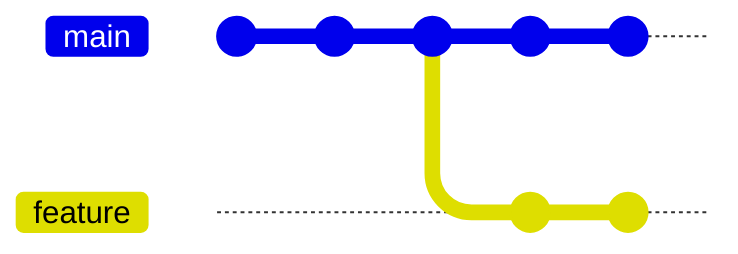
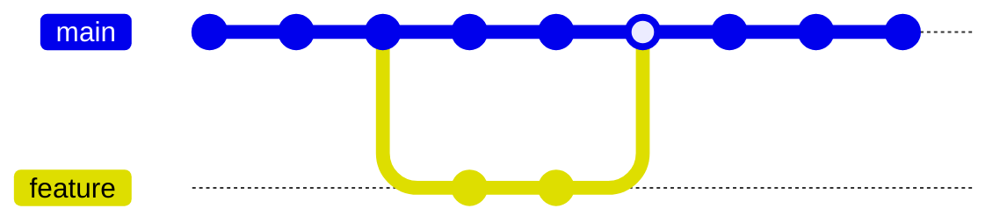

# What is a Branch?

Branches are lightweight, movable pointers to a specific commit that allow separate lines of development without impacting the main codebase.
* When you create a ***branch***, Git creates a ***reference*** and points it at your ***current  commit***
* As you make ***new commits***, Git automatically updates this ***reference*** to the ***latest commit***
* In this way, a ***branch reference*** always represents the latest line of development in a ***branch***



After completing work on a branch, changes can be merged back into the main codebase.



## Creating branches

To view the existing branches in a repository, use `git branch`:

```bash
> git branch
* main
  new-feature
```

> The `*` next to main indicates that main is the currently active branch.

To create a new branch, use:

```bash
git branch <branchname>
```

This creates a new branch named, however, it does not switch to the new branch.

## Deleting branches

To delete a branch, use the `-d` option:

```bash
git branch -d <branchname>
```

This deletes the `<branchname>` branch.

?> If you try to delete a branch that has changes that haven't been merged, Git will prevent you from doing so to avoid data loss.

In such cases, if you're sure you want to delete the branch, you can use the `-D` option instead:

```bash
git branch -D <branchname>
```

This forcefully deletes the unmerged `<branchname>` branch, discarding any unmerged changes.

## Renaming branches

To rename a branch, you can use the `-m` option with the `git branch` command:

```bash
git branch -m old-name new-name
```

This renames the branch `old-name` to `new-name`.

Remember to replace `old-name` and `new-name` with the current and new names of your branch, respectively.

## Switching branches

To switch to a branch, use `git switch`:

```bash
git switch <branch>
```

If you want to create a new branch and switch to it in one command, you can use the `-c` option:

```bash
git switch -c <new-branch>
```

This creates a new branch named `<new-branch>` and immediately switches to it.


## Merging changes

`git merge` allows you to combine changes from different, typically distinct, branches.

Git supports two types of merges:

1. **Fast-forward merges**: This type of merge can occur when there is a linear path from the current branch tip to the target branch. Instead of creating a new commit, Git just moves the current branch pointer up to the target branch pointer.

2. **Three-way merge**: This is the most common type of merge. When the two branches you're trying to merge have diverged, Git creates a new commit that includes changes from both branches. This is done by looking at the common ancestor of the two branches, the current branch, and the target branch.


### Basic merging

Let's start with a basic example. Suppose you have a repository with a `main` branch and a ``feature`` branch. You've made some changes in the ``feature`` branch and you want to bring those changes into the `main` branch.

First, switch to the `main` branch:

```bash
git switch main
```

Then, merge the `feature` branch into the `main` branch:

```bash
git merge feature
```

If the branches have diverged, Git will create a new commit to combine the changes from the `feature` branch into the `main` branch. If the branches have not diverged (if the `feature` branch was created from the `main` branch and the `main` branch has not changed since then), Git will perform a "fast-forward" merge, meaning it will just move the `main` branch pointer to point at the latest commit on the `feature` branch.

### Merging with conflicts

Merge conflicts occur when the same part of your code is changed in two branches that you're trying to merge together, and Git can't determine which change should take precedence.

When this happens, Git halts the merge process and requires manual intervention to resolve the conflict, after which you can continue with the merge.

For example, let's say you have a conflict. When you try to merge, you'll see an output like this:

```bash
git merge feature
```

**Output:**

```bash
Auto-merging file.txt
CONFLICT (content): Merge conflict in file.txt
Automatic merge failed; fix conflicts and then commit the result.
```

To `resolve` the conflicts, open the file with conflicts in your text editor. You'll see the conflicting changes marked like this:

```bash
<<<<<<< HEAD
This is some content from the main branch.
=======
This is some content from the feature branch.
>>>>>>> feature
```

Edit the file to `resolve` the conflicts, then add the file to the staging area:

```bash
git add file.txt
```

And commit the changes:

```bash
git commit -m "resolved merge conflict"
```

### Aborting a merge

If you start a merge and then decide you want to stop, you can abort the merge with the `--abort` option:

```bash
git merge --abort
```

This will stop the merge and return your repository to the state it was in before you started the merge.

## Cherry-picking changes

`git cherry-pick` enables you to pick a commit from one branch and apply it onto another. This is useful when you want to apply some commit without merging or rebasing the whole branch.

### Basic cherry-picking

Let's start with a basic example. Suppose you have a repository with a `main` branch and a `feature` branch. You've made a commit in the `feature` branch that you want to apply to the `main` branch.

First, get the commit hash of the commit you want to cherry-pick. You can do this with the `git log` command:

```bash
git log
```

This will show you a list of commits. Each commit has a hash, like `3a0b9b6`.

Now, switch to the `main` branch:

```bash
git switch main
```

Then, cherry-pick the commit:

```bash
git cherry-pick 3a0b9b6
```

This will apply the changes from the specified commit to the `main` branch.

### Cherry-picking multiple commits

You can also cherry-pick multiple commits at once. To do this, list the commit hashes separated by spaces:

```bash
git cherry-pick 3a0b9b6 5b6c7d6f
```

This will apply the changes from both commits to the `main` branch.

### Cherry-picking with conflicts

Sometimes, cherry-picking a commit might result in conflicts, especially if the commit depends on changes that are not present in the current branch. In this case, Git will pause the cherry-pick and allow you to resolve the conflicts.

When you try to cherry-pick, you'll see an output like this:

```bash
git cherry-pick 3a0b9b6
```

**Output:**

```bash
error: could not apply 3a0b9b6... Some commit message
hint: after resolving the conflicts, mark the corrected paths
hint: with 'git add <paths>' or 'git commit -a'
hint: and commit the result with 'git commit'
```

To resolve the conflicts, open the file with conflicts in your text editor. You'll see the conflicting changes marked like this:

```bash
<<<<<<< HEAD
This is some content from the main branch.
=======
This is some content from the feature branch.
>>>>>>> feature
```

Edit the file to resolve the conflicts, then add the file to the staging area:

```bash
git add file.txt
```

And continue the cherry-pick:

```bash
git cherry-pick --continue
```

### Aborting a cherry-pick

If you start a cherry-pick and then decide you want to stop, you can abort the cherry-pick with the `--abort` option:

```bash
git cherry-pick --abort
```

This will stop the cherry-pick and return your repository to the state it was in before you started the cherry-pick.

!> Remember, when using any commands that change history, it's important to make these changes before pushing to GitHub. When you change a commit ID that has been pushed to the remote, you risk creating problems for your collaborators.

## Quiz

<div class="quizdown">
  <div id="branches-quiz.js" ></div>
</div>