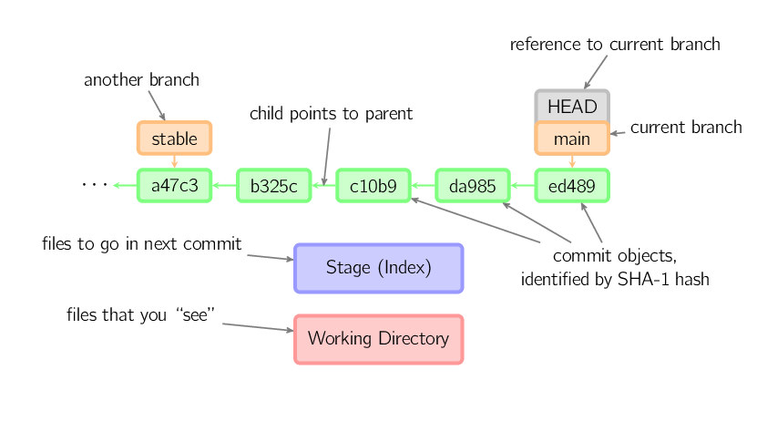

# What is a Commit?

A **commit** is a **snapshot** of your _entire_ repository at a given point in time.  A commit occurs when one or more changes are copied from the staging area to the repository.

## A typical workflow

As we mentioned in [How Git Works](git_101?id=how-git-works), git has a two-step process to save changes to a repository.


In practice, this looks like:
1. You make changes in your **working directory**
2. When you're ready to save these changes, you **stage** them using `git add`
3. Then you the **commit** the staged changes to the repository using `git commit`

## Staging changes

### git add

`git add <files>` copies changes from the working directory to the staging area.

## Committing changes

### git commit

`git commit -m "Commit message"` saves a snapshot of the changes in staging area to the local repository as a commit.


## Viewing history

### git log

```sh
git log
git log --oneline --graph --decorate --all
git log --stat
git log --patch
```

## Comparing changes

### git diff

`git diff` allows you to see the difference between any two refs in the repository. 

The diagram below shows how you can compare the content of your working area, staging, and HEAD (or the most recent commit):

<center>


</center>

```sh
git diff
git diff --staged
git diff HEAD
git diff --color-words
git diff <REF-1> <REF-2>
git diff main slow-down
git diff origin/main main
git diff 2710 b745
```

## Fixing mistakes

### git reset

Sometimes we are working on a branch, and we decide things aren't going quite like we had planned. We want to reset some, or even all, of our files to look like what they were at a different point in history.

<center>


</center>

Remember, there are three different snapshots of our project at any given time. The first is the most recent commit (also known as HEAD). The second is the staging area (also called the index). The third is the working directory containing any new, deleted, or modified files.

The `git reset` command has three modes, and they allow us to change some or all of these three snapshots.

It also helps to know what branches technically are: each is a pointer, or reference, to the latest commit in a line of work. As we add new commits, the currently checked-out branch "moves forward," so that it always points to the most recent commit.

#### Reset modes

The three modes for git reset are: `--soft`, `--mixed`, and `--hard`. For these examples, assume that we have a "clean" working directory, i.e. there are no uncommitted changes.

- `git reset --soft <SHA>` moves the current branch to point at the `<SHA>`. However, the working directory and staging area remain untouched. Since the snapshot that current branch points to now differs from the index's snapshot, this command effectively stages all differences between those snapshots. This is a good command to use when you have made numerous small commits, and you would like to regroup them into a single commit.
- `git reset --mixed <SHA>` makes the current branch *and* the staging area look like the `<SHA>` snapshot. *This is the default mode:* if you don't include a mode flag, Git will assume you want to do a `--mixed` reset. `--mixed` is useful if you want to keep all of your changes in the working directory, but change whether and how you commit those changes.
- `git reset --hard <SHA>` is the most drastic option. With this, Git will make all 3 snapshots, the current branch, the staging area, *and* your working directory, look like they did at `<other-commit>`. This can be dangerous! We've assumed so far that our working directory is clean. If it is not, and you have uncommitted changes, `git reset --hard` will *delete all of those changes*. Even with a clean working directory, use `--hard` only if you're sure you want to completely undo earlier changes.

### git checkout

-- files copies files from the stage to the working directory. Use this to throw away local changes

### git commit --amend

`git commit --amend` allows us to make changes to the commit that HEAD is currently pointing to. 

Two of the most common uses are:
- Re-writing commit messages
- Adding files to the commit

### git revert

`git revert` is used to create a new commit that undoes the changes made in a previous commit.

It's useful for fixing mistakes and for safely removing changes without rewriting the project's history. 

### git rebase

Reordering commit history with `git rebase -i` is a powerful way to clean up your project's timeline. 

Here's how to do it:

1. **Start Interactive Rebase**: First, check out the branch you want to reorder. Then, initiate an interactive rebase for the last `N` commits using `git rebase -i HEAD~N`. Replace `N` with the number of commits you want to reorder.

    ```bash
    git checkout feature-branch
    git rebase -i HEAD~3
    ```

    This command will open a text editor with a list of commits like this:

    ```
    pick e3f1e37 Commit message A
    pick 7c91bf1 Commit message B
    pick 4a07e8d Commit message C
    ```

2. **Reorder Commits**: In the text editor, reorder the lines to change the order of commits. Move the lines up or down as desired.

    ```
    pick 4a07e8d Commit message C
    pick e3f1e37 Commit message A
    pick 7c91bf1 Commit message B
    ```

3. **Resolve Conflicts**: If there are conflicts after reordering, Git will stop and let you resolve them. After fixing conflicts in a file, stage the changes with `git add` and then continue rebasing with `git rebase --continue`.

    ```bash
    # Fix conflicts in your files
    git add <file-with-conflict>
    git rebase --continue
    ```

    You may need to repeat this step if there are multiple conflicts.

4. **Force Push if Necessary**: If you've already pushed the branch to a remote repository, you'll need to force push your changes because the commit history has changed.

    ```bash
    git push --force
    ```

    Be cautious with this step, as it can overwrite history on the remote.

5. **Verify the New Order**: Use `git log` to ensure the commit history reflects your changes.

    ```bash
    git log --oneline
    ```

    You'll see the new order of commits:

    ```
    7c91bf1 Commit message B
    e3f1e37 Commit message A
    4a07e8d Commit message C
    ```

Remember to use `git rebase -i` with care, especially when working with branches that others might be using, as it rewrites commit history[1][2][4].

### git reflog

#### Does 'gone' really mean gone?

The answer: It depends!

```sh
git reflog
```

The reflog is a record of every place HEAD has been. In a few minutes we will see how the reflog can be helpful in allowing us to restore previously committed changes. But first, we need to be aware of some of the reflog's limitations:

- **The reflog is only local.** It is not pushed to the remote and only includes your local history. In other words, you can't see the reflog for someone else's commits, and they can't see yours.
- **The reflog is a limited time offer.** By default, reachable commits are displayed in the reflog for 90 days, but unreachable commits (meaning commits that are not attached to a branch) are only displayed for 30 days.

> Sometimes, you'll want to save your work in a commit without having to think of a commit message, or before you're ready to organize your changes. If that's the case, you can create aliases to create "save points". See the appendix with aliases to learn how!

## Syncing changes

### git fetch

`git fetch` This command downloads commits, files, and refs from a remote repository to your local repository, but it does not merge them with your local branches. 

It's a safe way to see what's happening on the remote repository before integrating changes into your local working copy. After fetching, you can inspect the changes or merge them manually with `git merge`.

### git pull

`git pull` This command is essentially a combination of `git fetch` followed by `git merge`. It downloads changes from the remote repository and immediately applies those changes to your current branch. 

This is typically used when you want to update your local branch with all data from its remote counterpart.

### git push

`git push` Uploads local repository content to a remote repository.


<center>



</center>

## Quiz

<div class="quizdown">
  <div id="commit-quiz.js" ></div>
</div>