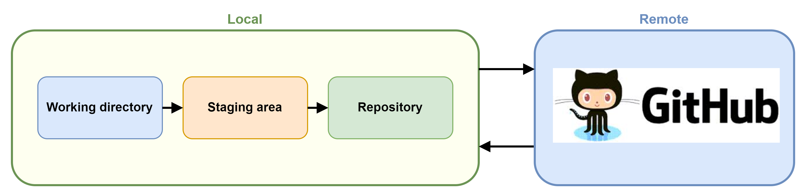

# What is Git?

Git is a popular version control system used for both open source and commercial software development, with the following unique features:

- **Distributed Version Control**: Unlike centralized version control systems, Git gives every developer a local copy of the entire project history. This means you can create commmits locally on your machine without needing a connection to the remote, and then sync or push changes when you reconnect.

- **Advanced Branching and Merging**: Git's branching model is extremely lightweight and fast, making it easy to experiment with different development paths. 

- **Rebasing and Cherry-Picking**: With Git's advanced features like rebase and cherry-pick, you can alter commit history for a cleaner, linear project history, or pick specific commits to apply to another branch. 

## How Git Works

Git manages and tracks changes to your code using three main areas: the Working Directory, the Staging Area, and the Repository.

1. **Working Directory**: This is where you'll be doing all your work: creating, editing, deleting and organizing files. When you make changes, Git recognizes that a file has changed in the working directory but it won't keep track of these changes until you tell it to.

2. **Staging Area**: Also known as the "index", the staging area is where Git tracks and saves changes that will go into your next commit, which means, when you make a change to a file, you'll need to add it to the staging area (with `git add`) to include it in your next commit.

3. **Repository**: This is where Git permanently stores changes as commits. You can think of it as a database of your project's history. Once you've staged your changes, you can commit them to the repository with `git commit`, which takes your changes from the staging area, wraps them in a new commit object, and stores it in your repository.

### Git Saves Snapshots

Unlike most other version control systems, git does not store your information as a series of changes, or _deltas_:

Instead, Git takes a **snapshot** of your _entire_ repository at a given point in time. This snapshot is called a **commit**.

## Quiz

  

