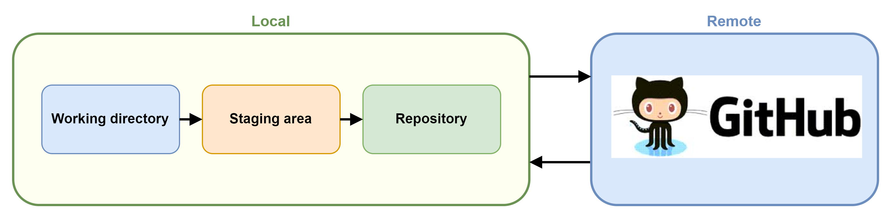

# What is a Repository?

A _repository_ is a centralized location that stores a collection of files along with their change history.

## Local vs Remote

As a **distributed** version control system, Git has the concept of _**local**_ and _**remote**_ repositories.



**Local repositories** consists of _three_ main areas:

1. **Working directory**: This is where you do your work - creating, editing, deleting and organizing files.
2. **Staging area**: This is where Git tracks and saves changes that will go into your next commit.
3. **Repository**: This is where Git permanently stores changes as commits.

**Remote repositories**, like those hosted on GitHub, _do not_ contain a **Working directory** and **Staging area**.

## Creating repositories

Repositories are created in one of two ways depending on whether you are starting from scratch or from an existing repository.

### git init

To create a new _**local**_ repository in the current directory:

```bash
git init
```

To create a new _**local**_ repository in the _specified_ directory:

```bash
git init <directory>
```

### git clone

To clone a _**remote**_ repository into a _new_ directory:

```bash
git clone <repository>
```

To clone a _**remote**_ repository into the _specified_ directory:

```bash
git clone <repository> <directory>
```

## Using repositories

### git status

To display the status of the working directory and the staging area:

```bash
git status
```

Files can be in one of three statuses:

1. **Untracked**: Files that have not yet been staged or committed.

  ```bash
  Untracked files:
    (use "git add <file>..." to include in what will be committed)
      hello.pyc
  ```

1. **Modified**: Modified files that have not yet been staged.

  ```bash
  Changes not staged for commit:
    (use "git add <file>..." to update what will be committed)
    (use "git checkout -- <file>..." to discard changes in working directory)
      modified: main.py
  ```

1. **Staged**: Modified files that have been marked to go into the next commit.

  ```bash
  On branch main
  Changes to be committed:
    (use "git reset HEAD <file>..." to unstage)
      modified: hello.py
  ```

## Understanding remotes

In distributed version control systems, it is common for many copies (or _clones_) of a repository to exist.

Git helps you manage connections between these repositories using `remotes`.

Specifically, when you clone a repository, Git automatically adds a remote named `origin` that points to the URL of the cloned repository.

> When you create a new repository using `git init`, Git does not add any remotes because Git does not yet know where you want to push to or pull from.

### git remote

To create, view, and delete connections to other repositories:

```bash
git remote
```

To view the remote connections along with their URLs:

```bash
git remote -v
```

### git remote add

To add a new remote connection:

```bash
git remote add <name> <url>
```

### git remote rename

To rename a remote connection:

```bash
git remote rename <old> <new>
```

### git remote remove

To remove a remote connection:

```bash
git remote remove <name>
```

### git remote set-url

To change the URL of a remote connection:

```bash
git remote set-url <name> <newurl>
```

### git remote show

To display information about a particular remote connection:

```bash
git remote show <name>
```

## Syncing repositories

### git fetch

To download commits, files, and refs from a remote repository, but ***not*** merge them with your local branches:

```bash
git fetch <remote> <branch>
```

> `git fetch` is a safe way to see what's happening on the remote repository before integrating changes into your local working copy. After fetching, you can inspect the changes or merge them manually with `git merge`.

### git pull

To download changes from a remote repository and immediately apply those changes to your current branch:

```bash
git pull <remote> <branch>
```

> `git pull` is essentially a combination of `git fetch` followed by `git merge`, and is used when you want to update your local branch with all data from its remote counterpart.

### git push

To upload your commits to the **default** remote repository (usually called `origin`) and the branch that you're currently on:

```bash
git push
```

If you have **multiple** remote repositories, you can specify which one to push to:

```bash
git push <remote>
```

You can also specify a **specific** branch you want to push:

```bash
git push <remote> <branch>
```

#### Setting an upstream branch

The first time you try to push a branch, you may need to set the upstream branch.

> This typically occurs when trying to push a branch other than `main` or `master`.

To set an upstream branch:

```bash
git push --set-upstream <remote> <branch>
```

> The `-u` or `--set-upstream` option sets the upstream branch

#### Force pushing

If your local branch and the remote branch have diverged (they both have commits that the other doesn't have), `git push` will fail.

You can force Git to overwrite the remote branch with your local branch using the `--force` option:

```bash
git push --force <remote> <branch>
```

!> Be careful using `git push --force`, as it can permanently delete commits on the remote branch.

## Configuration

### .gitignore

The `.gitignore` file is used by Git to determine which files and directories to ignore when committing changes. It's a plain text file where each line contains a pattern for files/directories to ignore.

Some notes on `.gitignore` files:

- Comments can be added in `.gitignore` with `#` at the start of the line.
- Blank lines are ignored.
- Standard glob patterns work.
- You can have multiple `.gitignore` files in a single repository. A `.gitignore` file in a specific directory applies to that directory and its subdirectories.
- If a file is already tracked by Git before it was added to `.gitignore`, you need to untrack it manually with `git rm --cached filename`.

#### Example .gitignore

```bash
# No .log files
*.log

# No .tmp files
*.tmp

# Ignore the node_modules directory
node_modules/

# Ignore all files in the dist directory
dist/*

# Ignore the .env file
.env
```

#### References

There are many online resources that provide comprehensive pre-built `.gitignore` files for a variety of project types.  Before you build your own, be sure to check the following sites:

- [github/gitignore repository](https://github.com/github/gitignore)
- [gitignore.io](https://www.toptal.com/developers/gitignore)

## Quiz

<div class="quizdown">
  <div id="repositories-quiz.js" ></div>
</div>
