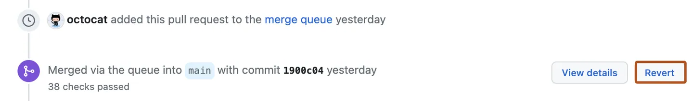
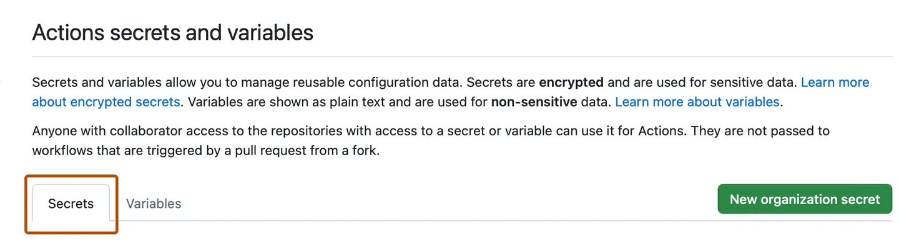

# Basic GitHub Administration

## Fixing mistakes

As a repository administrator, it is sometimes necessary to roll back changes made via **commit** or **pull request**.

### Reverting a commit

Reverting a commit is the simplest and safest way to 'undo' a commit while preserving a repository's history.

To revert a commit: 

- Clone the repository that you'd like to fix
- Find the ID of the commit that you would like to revert
- Use `git revert <commit id>` to create a new commit that undoes the changes introduced by the specified commit
- Use `git push` to push the new commit to the repository

### Resetting a branch

Resetting a branch is useful when you need to completely remove a commit from a repository.  This method requires rewriting a repository's history, so should be used with caution.

- Clone the repository that you'd like to fix
- Find the ID of the commit that you would like to reset the branch to
- Use `git reset <commit id>` to move the current branch to the specified commit.
- Use `git push --force` to push the change to the repository

### Reverting a pull request

Reverting a pull request creates a new pull request that contains one revert of the merge commit from the original merged pull request. 

> **Note:** To revert pull requests, you must have write permissions in the repository.

> **Note:** You may need to revert the individual commits in your pull request if either of the following is true.
> 
> - Reverting the pull request causes merge conflicts
> - The original pull request was not originally merged on GitHub. For example, someone could have merged the pull request using a fast-forward merge on the command line.
> 
> For more information about using Git to manually revert individual commits, see [Git revert](https://git-scm.com/docs/git-revert.html) in the Git documentation.

1. Under your repository name, click  Pull requests.

    

1. In the "Pull Requests" list, click the pull request you'd like to revert.
1. Near the bottom of the pull request, click **Revert**. If the **Revert** option isn't displayed, you'll need to ask the repository administrator for write permissions.

   

1. Merge the resulting pull request.

### Using Filter-Repo

`git filter-repo` is a faster and more flexible replacement for `git filter-branch`, designed to rewrite repository history. It can be used to delete sensitive data, change author/committer details, rename tags and branches, or perform other complex history rewrites.

1. Install git-filter-repo

    `git filter-repo` is not bundled with git. You need to install it separately. Here's how to install it using pip:

    ```bash
    python3 -m pip install --user git-filter-repo
    ```

2. Clone the repository that you'd like to fix

3. Use git-filter-repo

    **Example 1: Remove a File from Every Commit**

    To remove a file named `passwords.txt` from every commit:

    ```bash
    git filter-repo --path passwords.txt --invert-paths
    ```

    **Example 2: Change Email Address**

    To change an old email address to a new one across all commits:

    ```bash
    git filter-repo --mailmap my-mailmap
    ```

    In this command, `my-mailmap` is a file that should look like this:

    ```
    Old Name <old@email.com> New Name <new@email.com>
    ```

    **Example 3: Replace Text in Every File**

    To replace all occurrences of `oldtext` with `newtext` in every file:

    ```bash
    git filter-repo --replace-text expressions.txt
    ```

    In this command, `expressions.txt` is a file that should look like this:

    ```
    literal:oldtext==>newtext
    ```

4. Push Changes to Remote Repository

After you've rewritten history, you can force push your changes to the remote repository. Be careful, this will overwrite the remote repository and can cause problems for anyone who has cloned or forked your repository, or has outstanding branches.

```bash
git push --force origin main
```

## Handling large files

Git Large File Storage (LFS) is an extension for Git that deals with large files by storing them outside the repository, while still keeping track of their versions.

### What is Git LFS

- Git LFS allows seamless handling of large files (>100 MB) within Git repositories.
- It replaces large files with tiny pointer files, reducing repository size and improving performance.
- End-users can work with large files as if they were normal Git-managed files.

### How to setup Git LFS

1. Install Git LFS by downloading the installer from the [Git LFS website](https://git-lfs.github.com/).
2. Navigate to your Git repository and run `git lfs install` to initialize Git LFS.
3. Track large files using `git lfs track <pattern>` where `<pattern>` is a wildcard pattern matching the large files.
4. Commit and push changes as usual. Git LFS will handle large files transparently.

### Important things to know

- When you clone a repository with large files tracked by Git LFS, the large files are not downloaded by default. To download the large files, you need to check out the commit that includes them.
- Git LFS requires a LFS server to store the large files. GitHub provides LFS storage, but it's limited to 1 GB free storage and 1 GB free bandwidth per month. If you need more, you'll have to pay for it.
- Remember to commit your .gitattributes file to the repository. This ensures that other users who clone the repository know which files should be handled by Git LFS.
- If you forget to track large files with Git LFS and commit them as regular files, you'll need to rewrite your repository history to convert them to LFS objects.
- Git LFS is not suitable for all types of large files. If you have large files that change frequently, every change will create a new copy of the file in LFS, which can quickly consume your LFS storage quota. In such cases, you might need to consider other solutions, such as storing the large files outside of Git.

## Managing secrets

Secrets are variables that you create in an organization, repository, or repository environment. The secrets that you create are available to use in GitHub Actions workflows. GitHub Actions can only read a secret if you explicitly include the secret in a workflow.

For secrets stored at the organization-level, you can use access policies to control which repositories can use organization secrets. Organization-level secrets let you share secrets between multiple repositories, which reduces the need for creating duplicate secrets. Updating an organization secret in one location also ensures that the change takes effect in all repository workflows that use that secret.

For secrets stored at the environment level, you can enable required reviewers to control access to the secrets. A workflow job cannot access environment secrets until approval is granted by required approvers.

### Naming your secrets

The following rules apply to secret names:

- Names can only contain alphanumeric characters (`[a-z]`, `[A-Z]`, `[0-9]`) or underscores (`_`). Spaces are not allowed.
- Names must not start with the `GITHUB_` prefix.
- Names must not start with a number.
- Names are case insensitive.
- Names must be unique at the level they are created at.

    For example, a secret created at the environment level must have a unique name in that environment, a secret created at the repository level must have a unique name in that repository, and a secret created at the organization level must have a unique name at that level.

    If a secret with the same name exists at multiple levels, the secret at the lowest level takes precedence. For example, if an organization-level secret has the same name as a repository-level secret, then the repository-level secret takes precedence. Similarly, if an organization, repository, and environment all have a secret with the same name, the environment-level secret takes precedence.

To help ensure that GitHub redacts your secret in logs, avoid using structured data as the values of secrets. For example, avoid creating secrets that contain JSON or encoded Git blobs.

### Accessing your secrets

To make a secret available to an action, you must set the secret as an input or environment variable in the workflow file. Review the action's README file to learn about which inputs and environment variables the action expects. 

You can use and read secrets in a workflow file if you have access to edit the file. 

Organization and repository secrets are read when a workflow run is queued, and environment secrets are read when a job referencing the environment starts.

You can also manage secrets using the REST API. 

### Creating secrets for a repository

To create secrets or variables on GitHub for a personal account repository, you must be the repository owner. To create secrets or variables on GitHub for an organization repository, you must have admin access. Lastly, to create secrets or variables for a personal account repository or an organization repository through the REST API, you must have collaborator access.

1. On GitHub.com, navigate to the main page of the repository.
1. Under your repository name, click  Settings. If you cannot see the "Settings" tab, select the  dropdown menu, then click Settings.

    

1. Screenshot of a repository header showing the tabs. The "Settings" tab is highlighted by a dark orange outline.
1. In the "Security" section of the sidebar, select  Secrets and variables, then click Actions.
1. Click the Secrets tab.

   

1. Click **New repository secret**.
1. In the **Name** field, type a name for your secret.
1. In the **Secret** field, enter the value for your secret.
1. Click **Add secret**.

If your repository has environment secrets or can access secrets from the parent organization, then those secrets are also listed on this page.

### Creating secrets for an organization

When creating a secret or variable in an organization, you can use a policy to limit access by repository. For example, you can grant access to all repositories, or limit access to only private repositories or a specified list of repositories.

To create secrets or variables at the organization level, you must be an organization owner.

1. On GitHub.com, navigate to the main page of the organization.
1. Under your organization name, click  Settings. If you cannot see the "Settings" tab, select the  dropdown menu, then click Settings.

    

1. Screenshot of the tabs in an organization's profile. The "Settings" tab is outlined in dark orange.
1. In the "Security" section of the sidebar, select  Secrets and variables, then click Actions.
1. Click the Secrets tab.

   

1. Click **New organization secret**.
1. Type a name for your secret in the **Name** input box.
1. Enter the **Value** for your secret.
1. From the **Repository access** dropdown list, choose an access policy.
1. Click **Add secret**.

### Limits for secrets

You can store up to 1,000 organization secrets, 100 repository secrets, and 100 environment secrets.

A workflow created in a repository can access the following number of secrets:

- All 100 repository secrets.
- If the repository is assigned access to more than 100 organization secrets, the workflow can only use the first 100 organization secrets (sorted alphabetically by secret name).
- All 100 environment secrets.

Secrets are limited to 48 KB in size. 

### Redacting secrets from workflow run logs

While GitHub automatically redacts secrets printed to workflow logs, runners can only delete secrets they have access to. This means a secret will only be redacted if it was used within a job. As a security measure, you can delete workflow run logs to prevent sensitive values being leaked.