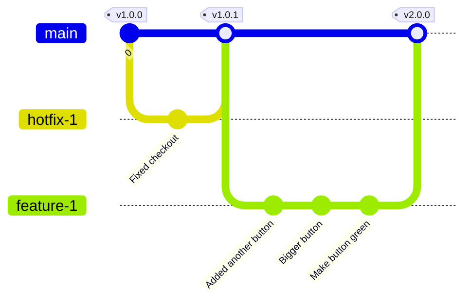

# What are Branching Strategies?

A branching strategy is a set of guidelines and practices that software development teams adopt to manage and structure their code changes using branches in Git.

Branching strategies help:
- Coordinate work among team members
- Enable parallel development
- Ensure a smooth integration and deployment process
- Minimize conflicts during merges
- Maintain the stability of the main codebase during development

## GitHub Flow

GitHub Flow is a lightweight, branching strategy that enables teams and projects to make production deployments regularly.

### Benefits of GitHub Flow

GitHub Flow offers several advantages over other Git workflows, such as Git Flow:

1. **Simplicity:** GitHub Flow is simpler and easier to understand than Git Flow, making it accessible to developers of all skill levels
2. **Flexibility:** The lightweight nature of GitHub Flow allows teams to adapt the workflow to their specific needs and requirements
3. **Reduced cycle time:** Less branches means less opportunity for merge conflicts, which means teams can deploy changes to production more frequently, enabling faster iterations and shorter feedback loops
4. **Improved collaboration:** Pull requests facilitate code reviews and discussions, leading to better collaboration and knowledge sharing among team members

### How GitHub Flow Works

The GitHub Flow process consists of the following steps:

1. **Create a branch:** Create a new branch from the main (previously known as master) branch for each feature, bug fix, or experiment you want to work on
2. **Make changes and commit:** Make changes to the code in your branch and commit them with descriptive messages explaining what has changed and why
3. **Open a pull request:** When your changes are ready for review, open a pull request to notify your team and start a discussion about the changes
4. **Review and discuss:** Your team reviews the changes, provides feedback, and discusses any necessary modifications
5. **Deploy:** Once the pull request is approved, deploy the changes to staging, QA, and production for final testing
6. **Merge:** After successful testing, merge the pull request into the main branch

**The key rule in GitHub Flow is that the main branch should always be deployable.**

This means that any changes made to the main branch should be thoroughly tested and ready for production.

### GitHub Flow vs. Git Flow

While Git Flow is a popular and well-established workflow, it has some drawbacks that GitHub Flow addresses:

- **Complexity:** Git Flow is more complex than GitHub Flow, with multiple long-running branches (develop, release, hotfix) and strict rules governing their use.  This complexity can be overwhelming for some teams and may lead to confusion and errors.
- **Release overhead:** Git Flow is designed around less frequent releases, with a dedicated release branch for preparing and stabilizing the code. This can slow down the deployment process and reduce the team's ability to deliver updates quickly.
- **Lack of continuous deployment:** The Git Flow process is not optimized for continuous deployment, as it relies on periodic merges from the develop branch to the main branch. This can lead to longer feedback loops and delayed bug fixes.

In contrast, GitHub Flow embraces simplicity, flexibility, and continuous deployment. By using short-lived feature branches and encouraging frequent deployments, GitHub Flow enables teams to deliver value to users more quickly and respond to feedback more effectively.

## Branching Structure

