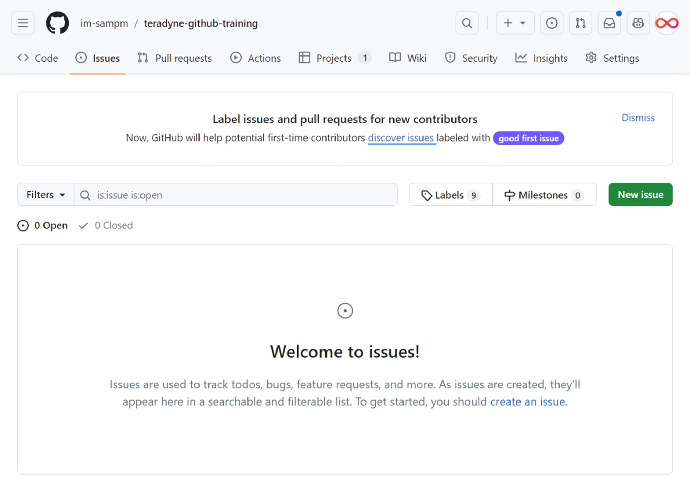

# What is an Issue?

In GitHub, you will use issues to record and discuss ideas, enhancements, tasks, and bugs. Issues make collaboration easier by:

- Replacing email for project discussions, ensuring everyone on the team has the complete story, both now and in the future.
- Allowing you to cross-link to related issues and pull requests.
- Creating a single, comprehensive record of how and why you made certain decisions.
- Allowing you to easily pull the right people into a conversation with @ mentions and team mentions.



## Creating an issue

Follow these steps to create an issue in the class repository:

1. Click the **Issues** tab.
1. Click **New Issue**.
1. Type the following in the Subject line: `YOUR-USERNAME Workflow`
1. In the body of the issue, include the text below:

   ```md
   YOUR-USERNAME will update a file by replacing a caption.

   - [ ] Create a branch
   - [ ] Edit the file
   - [ ] Commit the changes
   - [ ] Create a Pull Request
   - [ ] Request a Review
   - [ ] Make more changes
   - [ ] Get an approval
   - [ ] Merge the Pull Request
   ```

1. Click the *Submit new issue* button to open your issue.


## Best practices

### Avoid Duplication

The first step in writing a GitHub issue is to utilize the search feature to ensure that a similar issue doesn't already exist. In instances of duplicate issues, one should be closed, and this is typically the less detailed issue. 
    
- Ensure that the closing comment contains a link to the remaining open issue (e.g., "Duplicate of #123") and that any relevant details from the closed issue are consolidated into the open one.

### One Issue per Issue

It's essential to avoid combining multiple topics into a single issue. Each bug or feature request should be documented in its own issue.

- **Bad:** "The form needs a subject field. Also, the submit button is broken."
  (Separate these into two issues.)
- **Good:** "Add a subject field to form"
- **Good:** "Submit button causes 405 error"

While some issues may be complex, particularly with significant feature requests, it's beneficial to separate them into multiple issues whenever possible.

**Keep issue titles concise**, descriptive, and compelling.

**Markdown** is a simple way to style text on GitHub, making well-formatted issues easier to read and understand.

### Writing and Formatting Markdown

Markdown is a lightweight and easy-to-use syntax for styling all forms of writing on the GitHub platform. [Learn more about Markdown](https://guides.github.com/features/mastering-markdown/).

- **Links:** Include links to specific application views being described.
- **Screenshots:** Utilize screenshots to clarify the observed issue.
- **@ Mention:** If specific users within your organization need to be alerted, mention them in the issue.

### Objectivity

A well-defined issue avoids speculation and opinion. When reporting bugs, provide thorough descriptions and refrain from assuming the cause. For feature requests, focus on describing the problem rather than prescribing a solution.

- **Bad:** "Make the button red."
- **Good:** "Users don't understand that deletion is irreversible."

Avoid hypothetical scenarios unless backed by a genuine need, reinforcing the use of user stories.

### Reproduction Steps

When logging a bug, provide **clear** instructions to reproduce it. Simplify the steps and verify their reliability.

Be precise in instructions; for example, instead of "enter text in the search input," specify the exact text causing the error.