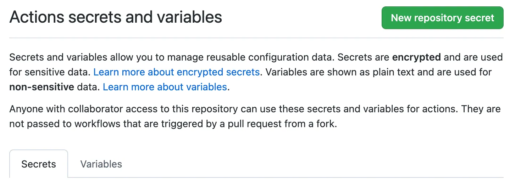

# Managing secrets

Secrets are variables that you create in an organization, repository, or repository environment. The secrets that you create are available to use in GitHub Actions workflows. GitHub Actions can only read a secret if you explicitly include the secret in a workflow.

For secrets stored at the organization-level, you can use access policies to control which repositories can use organization secrets. Organization-level secrets let you share secrets between multiple repositories, which reduces the need for creating duplicate secrets. Updating an organization secret in one location also ensures that the change takes effect in all repository workflows that use that secret.

For secrets stored at the environment level, you can enable required reviewers to control access to the secrets. A workflow job cannot access environment secrets until approval is granted by required approvers.

## Naming your secrets

The following rules apply to secret names:

- Names can only contain alphanumeric characters (`[a-z]`, `[A-Z]`, `[0-9]`) or underscores (`_`). Spaces are not allowed.
- Names must not start with the `GITHUB_` prefix.
- Names must not start with a number.
- Names are case insensitive.
- Names must be unique at the level they are created at.

    For example, a secret created at the environment level must have a unique name in that environment, a secret created at the repository level must have a unique name in that repository, and a secret created at the organization level must have a unique name at that level.

    If a secret with the same name exists at multiple levels, the secret at the lowest level takes precedence. For example, if an organization-level secret has the same name as a repository-level secret, then the repository-level secret takes precedence. Similarly, if an organization, repository, and environment all have a secret with the same name, the environment-level secret takes precedence.

To help ensure that GitHub redacts your secret in logs, avoid using structured data as the values of secrets. For example, avoid creating secrets that contain JSON or encoded Git blobs.

## Accessing your secrets

To make a secret available to an action, you must set the secret as an input or environment variable in the workflow file. Review the action's README file to learn about which inputs and environment variables the action expects. 

You can use and read secrets in a workflow file if you have access to edit the file. 

Organization and repository secrets are read when a workflow run is queued, and environment secrets are read when a job referencing the environment starts.

You can also manage secrets using the REST API. 

## Creating secrets for a repository

To create secrets or variables on GitHub for a personal account repository, you must be the repository owner. To create secrets or variables on GitHub for an organization repository, you must have admin access. Lastly, to create secrets or variables for a personal account repository or an organization repository through the REST API, you must have collaborator access.

1. On GitHub.com, navigate to the main page of the repository.
1. Under your repository name, click  Settings. If you cannot see the "Settings" tab, select the  dropdown menu, then click Settings.

    

1. Screenshot of a repository header showing the tabs. The "Settings" tab is highlighted by a dark orange outline.
1. In the "Security" section of the sidebar, select  Secrets and variables, then click Actions.
1. Click the Secrets tab.

   

1. Click **New repository secret**.
1. In the **Name** field, type a name for your secret.
1. In the **Secret** field, enter the value for your secret.
1. Click **Add secret**.

If your repository has environment secrets or can access secrets from the parent organization, then those secrets are also listed on this page.

## Creating secrets for an organization

When creating a secret or variable in an organization, you can use a policy to limit access by repository. For example, you can grant access to all repositories, or limit access to only private repositories or a specified list of repositories.

To create secrets or variables at the organization level, you must be an organization owner.

1. On GitHub.com, navigate to the main page of the organization.
1. Under your organization name, click  Settings. If you cannot see the "Settings" tab, select the  dropdown menu, then click Settings.

    

1. Screenshot of the tabs in an organization's profile. The "Settings" tab is outlined in dark orange.
1. In the "Security" section of the sidebar, select  Secrets and variables, then click Actions.
1. Click the Secrets tab.

   

1. Click **New organization secret**.
1. Type a name for your secret in the **Name** input box.
1. Enter the **Value** for your secret.
1. From the **Repository access** dropdown list, choose an access policy.
1. Click **Add secret**.

## Limits for secrets

You can store up to 1,000 organization secrets, 100 repository secrets, and 100 environment secrets.

A workflow created in a repository can access the following number of secrets:

- All 100 repository secrets.
- If the repository is assigned access to more than 100 organization secrets, the workflow can only use the first 100 organization secrets (sorted alphabetically by secret name).
- All 100 environment secrets.

Secrets are limited to 48 KB in size. 

## Redacting secrets from workflow run logs

While GitHub automatically redacts secrets printed to workflow logs, runners can only delete secrets they have access to. This means a secret will only be redacted if it was used within a job. As a security measure, you can delete workflow run logs to prevent sensitive values being leaked.