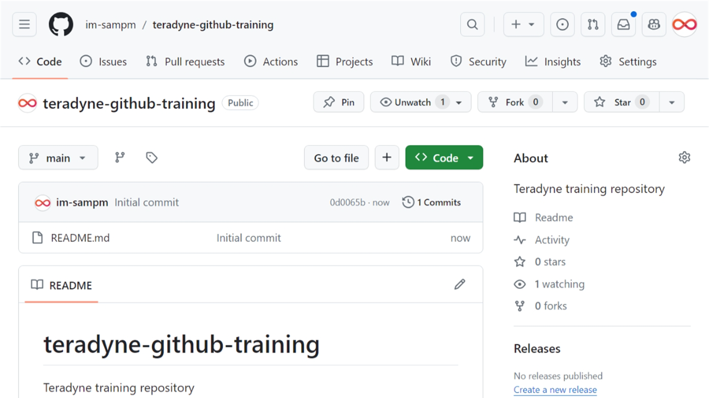
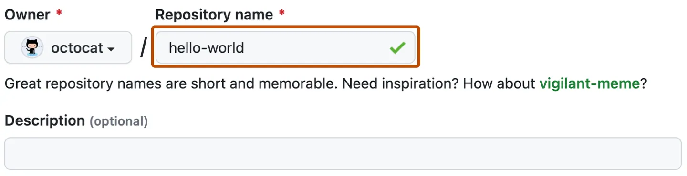

# What is a Repository?

A _repository_ is a centralized location that stores a collection of files along with their git history.

## Navigating repositories



### Sections


Location where GitHub displays the files included in the repository. GitHub also displays an About section, the most recent commit in history and the current working branch (there could be more to display as well depending on repository settings).


Tickets to track bugs and feature requests. Issues can be assigned to specific team members and are designed to encourage discussion and collaboration.


Pull requests represent a change, such as adding, modifying, or deleting files, which the author would like to make to files on the repository. Pull Requests enable collaboration through conversations and pull request reviews.


Kanban style boards that all you to visualize your work. Projects can be created at the repository or organization level.


Wikis are to communicate project details, display user documentation, or almost anything your heart desires. GitHub utilizes git to help keep track of the edits to the Wiki in version control.

## Creating repositories

### GitHub Website

<div class="grid2">
<div class="col">

1. In the upper-right corner of any page, select New repository.

</div><div class="col">


</div>
</div>

<div class="grid2">
<div class="col">

2. Type a short, memorable name for your repository.

</div><div class="col">



</div>
</div>

3. Optionally, add a description of your repository.

4. Choose a repository visibility. For more information, see "[About repositories](https://docs.github.com/en/repositories/creating-and-managing-repositories/about-repositories#about-repository-visibility)."

5. Select Initialize this repository with a README.

6. Click Create repository.

### GitHub CLI

#### gh repo create

To create a remote repository, use:

```bash
gh repo create <repository name> [visibility]

```

> where [visibility] is one of: `--public`, `--private`, or `--internal`.

To clone the new repository locally:

```bash
gh repo create <repository name> [visibility] --clone

```

To create a remote repository from an existing local repository, specify the source directory with `--source`. By default, the remote repository name will be the name of the source directory. Pass `--push` to push any local commits to the new repository.

## Best practices

Creating the following files is considered best practice when hosting repositories on GitHub:

- `README.md` used to explain the project and point readers to helpful information within the project.

- `CONTRIBUTING.md` used to describe the process for collaboration on a repository. A link to the CONTRIBUTING.md file is shown when a user attempts to create a new issue or pull request.

- `ISSUE_TEMPLATE.md` used to generate templated starter text for your project issues. Any time an issue is opened, the content in the template will be pre-populated in the issue body.

- `PULL_REQUEST_TEMPLATE.MD` used to generate a templated starter text for your project pull requests.  Any time a pull request is opened, the content of this template will be pre-populated in the pull request body.
