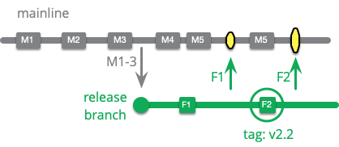

# What is a Branch?

A Git branch represents an independent line of development within a project. Branches are lightweight, movable pointers to a specific commit, allowing developers to diverge from the main line of development and work on new features or bug fixes without affecting the main codebase. 

<center>


</center>

## Creating branches

### git branch

Type `git branch <name>` to create a new branch.

### git branch --all

Type `git branch --all` to see all the local branches, including the read-only copies of your remote branches (you can add the `--all` option or just `-a`).

```sh
git branch --all
* main
  remotes/origin/HEAD -> origin/main
  remotes/origin/main
```

> The `--all` and `-a` are actually synonyms for the branch command. Git often provides a verbose and a short option.

## Switching branches

### git switch

`git switch` allows you to switch your current HEAD branch. 

> It's relatively new (added in Git v2.23) and provides a simpler alternative to the classic "checkout" command.

The most common scenario is to simply specify the local branch you want to switch to:

```sh
$ git switch other-branch
```

This will make the given branch the new HEAD branch. If, in one go, you also want to create a new local branch, you can use the "-c" parameter:

```sh
$ git switch -c new-branch
```

If you want to check out a remote branch (that doesn't yet exist as a local branch in your local repository), you can simply provide the remote branch's name. When Git cannot find the specified name as a local branch, it will assume you want to check out the respective remote branch of that name:

```sh
$ git switch remote-branch
```

This will not only create a local branch, but also set up a "tracking relationship" between the two branches, making sure that pulling and pushing will be as easy as "git pull" and "git push".

## Renaming branches

### git branch -m

Utilize the `-m` flag to rename the branch using the following syntax:

`git branch -m old-branch new-branch`

For example, to rename `test-branch` to `test-branch2`, execute:

`git branch -m test-branch test-branch2`

## Integrating changes

### git merge

The `git merge` command lets you take the commits(or changes) created on a git branch and integrate them into the target branch.

#### For example:
```sh
git merge <BRANCH-NAME>
```
### git cherry-pick

**Cherry-picking** allows you to pick up a commit from your reflog or another branch of your project and move it to your current branch.

<center>


</center>

For example, if your file directory and log look like this:

```shell-session
$ ls
README.md
$ git log --oneline
84nqdkq initializing repo with README
```

Let's cherry-pick the commit where we added file 4:

1. Find the commit ID where you added file4.md: `git reflog`
1. Cherry-pick that commit: `git cherry-pick <SHA>`

Now when you view your directory and log, you should see:

```shell-session
$ ls
file4.md
README.md
$ git log --oneline
eanu482 adding file 4
84nqdkq initializing repo with README
```

Is the commit ID the same as the one you used in the cherry-pick command? Why or why not?

!> Remember, when using any commands that change history, it's important to make these changes before pushing to GitHub. When you change a commit ID that has been pushed to the remote, you risk creating problems for your collaborators.


## Tagging branches

Tags and branches serve different purposes in version control:

- **Branches** are for ongoing development, such as adding new features or fixing bugs. They allow separate lines of development without impacting the main codebase. After completing work on a branch, changes can be merged back into the main codebase.

- **Tags** mark specific points in the repository's history, indicating important milestones like releases. Unlike branches, tags are not intended for ongoing development but rather to reference specific points in the development timeline.

### When to use branches

- **Scenario:** Want to add a new feature or experiment without affecting the main codebase.
- **Use:** Create a Git branch to isolate development work from the main codebase. Merge back into the main branch after completing and testing the feature.

### When to use tags

- **Scenario:** Ready to release a new software version to users.
- **Use:** Apply a Git tag to mark the current state of the codebase as a new version release. Tag with a version number and brief description of changes for easy reference and rollback if needed.

> Additionally, using tags and branches in **CI/CD Pipelines** help to keep development organized and efficient for streamlined collaboration, automated testing, CI/CD integration, documentation, and visibility.

### When to use release branches

Release branches are handy when your team struggles to maintain a healthy mainline. They help focus on bug fixes for production readiness.

Best teams skip release branches for single-production products. Instead, they directly release commits from the mainline.

Use release branches for managing multiple versions in production or when facing significant release process friction.

They can act as a quarantine zone during approval delays. Streamline the release process where possible.

Consider them as Environment Branches and understand the long-lived release branch variant.

