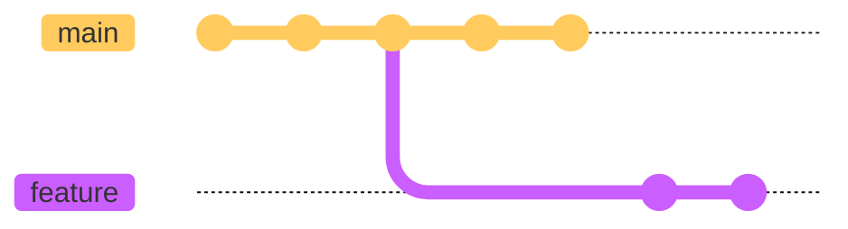
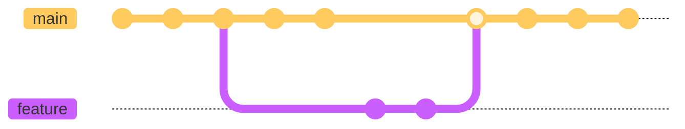

# What is a Branch?

Branches are lightweight, movable bookmarks to a specific commit that allow separate lines of development without impacting the main codebase. 



After completing work on a branch, changes can be merged back into the main codebase.



## Creating branches

### git branch

To create a new branch, use the `git branch` command followed by the name of the new branch.

```bash
git branch new-feature
```

This creates a new branch named new-feature. However, it does not switch to the new branch. To verify that the branch has been created, you can use the git branch command with no arguments:

```bash
git branch
```

Output:

```bash
* master
  new-feature
```

The `*` next to master indicates that master is the currently active branch.

## Switching branches

### git switch

To switch to the `new-feature` branch, you can use the `git switch` command:

```bash
git switch new-feature
```

Now, if you run `git branch` again, you'll see that the `*` is next to `new-feature`, indicating that it's the currently active branch:

Output:

```bash
  master
* new-feature
```

### git switch -c

If you want to create a new branch and switch to it in one command, you can use the `-c` option with the `git switch` command:

```bash
git switch -c another-feature
```

This creates a new branch named `another-feature` and immediately switches to it.

## Deleting branches

### git branch -d

To delete a branch, use the `-d` option with the `git branch` command:

```bash
git branch -d new-feature
```

This deletes the `new-feature` branch. If you try to delete a branch that has changes that haven't been merged, Git will prevent you from doing so to avoid data loss. 

### git branch -D

In such cases, if you're sure you want to delete the branch, you can use the `-D` option instead:

```bash
git branch -D unmerged-feature
```

This forcefully deletes the `unmerged-feature` branch, discarding any unmerged changes.

## Renaming branches

### git branch -m

To rename a branch, you can use the `-m` option with the `git branch` command:

```bash
git branch -m old-name new-name
```

This renames the branch `old-name` to `new-name`.

Remember to replace `old-name` and `new-name` with the current and new names of your branch, respectively.

## Integrating changes

### git merge

The `git merge` command lets you take the commits(or changes) created on a git branch and integrate them into the target branch.

#### For example:
```sh
git merge <BRANCH-NAME>
```
### git cherry-pick

**Cherry-picking** allows you to pick up a commit from your reflog or another branch of your project and move it to your current branch.

<center>


</center>

For example, if your file directory and log look like this:

```shell-session
$ ls
README.md
$ git log --oneline
84nqdkq initializing repo with README
```

Let's cherry-pick the commit where we added file 4:

1. Find the commit ID where you added file4.md: `git reflog`
1. Cherry-pick that commit: `git cherry-pick <SHA>`

Now when you view your directory and log, you should see:

```shell-session
$ ls
file4.md
README.md
$ git log --oneline
eanu482 adding file 4
84nqdkq initializing repo with README
```

Is the commit ID the same as the one you used in the cherry-pick command? Why or why not?

!> Remember, when using any commands that change history, it's important to make these changes before pushing to GitHub. When you change a commit ID that has been pushed to the remote, you risk creating problems for your collaborators.

## Quiz

<div class="quizdown">
  <div id="branches-quiz.js" ></div>
</div>