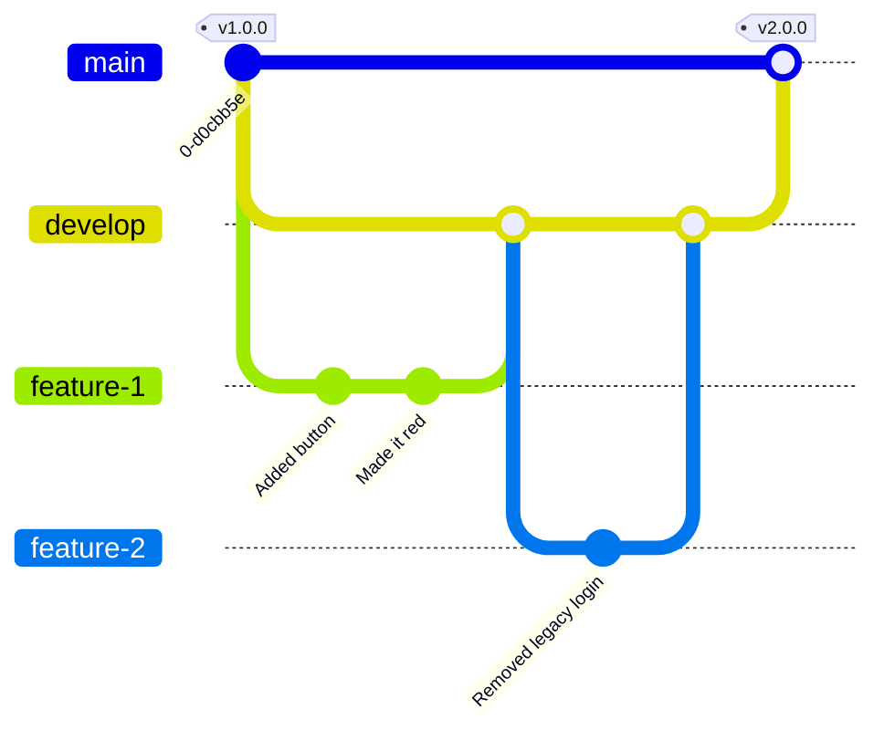
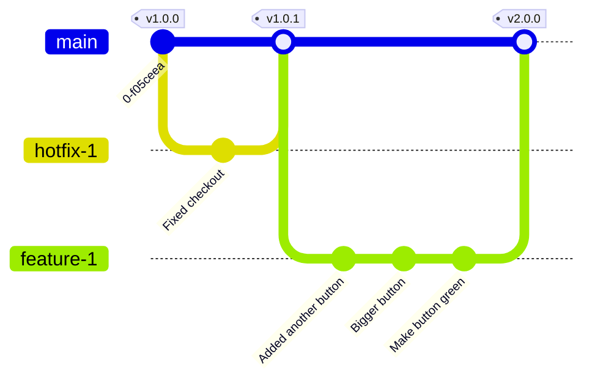

# Workflows

## Git-flow vs GitHub-flow

A list of requirements:

-   Stakeholders expect a list of provided features every few days in a human-friendly report.
-   Every change must have been reviewed before being deployed.
-   Every change must have passed our automated checks before being deployed.
-   Every change must have been verified by QA staff before being deployed.

### git-flow Structure
See: [A Successful Git Branching Model](https://nvie.com/posts/a-successful-git-branching-model/) (original article)

-   `main` is the stable branch (the `master` naming is **no longer** the default in the GIT community at large).
-   `release` is the `develop` branch.

The idea of git-flow is to keep a `main` branch always ready for release, while backwards-incompatible changes accumulate in a `develop` branch, to allow for breaking change releases to not interfere with the stability of the library being maintained.

This is very critical for frameworks and libraries that are distributed to consumers with a backwards compatibility promise.

`main` moves whenever a new public release is necessary:

-   a security patch is needed (x.y.Z, usually)
-   a bugfix patch is needed (x.y.Z)
-   a new feature is completed and ready for publishing (x.Y.z)
-   a new major release is needed (X.y.z)

`develop` moves whenever a piece of development work is complete: it is not associated with releases. The idea is that this eases following [SemVer](https://semver.org/spec/v2.0.0.html), while still allowing developers to work on breaking changes internally, accumulating them, without having to hold back major pieces of work, and without affecting downstream consumers.



The independence of `main` from `develop` allows critical fixes to land in `main` regardless of how much `develop` changed. A hotfix can be applied to `main`, while work continues on `develop`. This allows the library to stay stable, receive fixes, while still being improved behind the scenes:

```mermaid
    gitGraph
       commit tag:"v1.0.0"
       branch hotfix-1
       branch develop
       branch feature-1
       commit id: "Added another button"
       checkout main
       checkout hotfix-1
       commit id: "Fixed checkout"
       checkout main
       merge hotfix-1 tag:"v1.0.1"
       checkout develop
       merge main
       checkout feature-1
       commit id: "Bigger button"
       commit id: "Make button green"
       checkout develop
       merge feature-1
       checkout main
       merge develop tag:"v2.0.0"
```

Note how this requires `main` to be merged into `develop` after a release, or else the two histories will **diverge**.

### GitHub-flow Structure

[GitHub Flow](https://githubflow.github.io/)

The GitHub-flow approach is more linear and requires `main` to be deployable **at any point in time**.

Hotfixes, features, and bugs all go back to mainline, and bugs are communicated to consumers at the time of the changelog landing in mainline:




Only one `main` branch acts as a safe reference, and everything else happens inside pull requests ("merge requests" in **GitLab**).

In GitHub-flow, the project moves with the merged patches, without any "going back" (except for reverts).

### Complexity and Scope of git-flow

Git-Flow was designed for maintaining libraries. Libraries are slow-moving, stable pieces of code, with lots of downstream consumers, and stability takes priority over velocity and continuous improvement. 

While it is possible to do continuous delivery with git-flow (just merge to `main` every time a new change lands to `develop`), it becomes a bottleneck, and it is more error-prone.

GitHub-flow, on the other hand, allows for more streamlined development, with fewer ceremonies around the branches in use: fewer moving parts means less complexity. 

Since the idea behind GitHub-flow is that `main` is always deployable, every change must be validated on its own feature or hotfix branch first.

### Reviews and QA

Both in git-flow and GitHub-flow, before landing a patch, changes are verified:

-   Automated tests (existing and new)
  - GitHub Actions for both flows
-   Quality assurance tooling
-   Peer review(s)
-   QA staff performing exploratory testing

Once a patch passes all of the above, it is merged to `develop` (git-flow) or `main` (GitHub-flow or git-flow hotfix).

There is one major pitfall in the git-flow scenario: a verification can become stale. 

The verification performed by peer reviewers and QA staff gets invalidated by the fact that the patch remains in `develop` for a longer time before making it into production

GitHub-flow
----------------------------------------

### Deployment Implications of Switching to GitHub-flow

With GitHub-flow, one of the implications is that a patch should go live when we merge it. This means that deployment procedures will be stressed more, especially with humans involved.

It is endorsed to mitigate this via automation, but for that to happen reliably, the entire deployment should be automated, rather than just parts of it.

Switching to a previous stable release (rollback) in case of a failed deployment **must** also be automatic to avoid affecting production uptime in case of defects. If rollbacks are not viable, then some mitigation procedure (change reverting + re-deploy) is needed.

### Development Implications of Switching to GitHub-flow

Because changes land directly in `main` in GitHub-Flow, the main advantage is that changes go live quicker: this allows developers to get faster feedback.

Instead of looking for the reason for a defect inside a release with a large `git diff`, we get a more precise idea of which changes broke some behavior.

### Release Naming Implication of Switching to GitHub-flow

Because GitHub-flow encourages rolling releases, introducing a process that assigns artificial names to such releases is not necessary: the current git HEAD SHA1 usually suffices to pinpoint a release.

Past releases lose relevance too, as "what is currently live" becomes more important (as it should).

In order to satisfy the requirement for release management from stakeholders, it is possible to:

1.  Generate a report: GitHub **and** GitLab have such functionality, coupled with pull- and merge-requests
2.  Generate a release report in the issue tracker: could be as easy as a live query that shows which features landed and in which timeframe


<!-- ## Understanding the GitHub flow

In this section, we discuss the collaborative workflow enabled by GitHub.

## The essential GitHub workflow


The GitHub flow is a lightweight workflow that allows developers to experiment with new ideas safely, without fear of compromising a project.


### Exploring

Here are some interesting things you can check out later:

- *[guides.github.com/introduction/flow/](https://guides.github.com/introduction/flow/)* An interactive review of the GitHub Workflow. -->

### When to use release branches

Release branches are handy when your team struggles to maintain a healthy mainline. They help focus on bug fixes for production readiness.

Best teams skip release branches for single-production products. Instead, they directly release commits from the mainline.

Use release branches for managing multiple versions in production or when facing significant release process friction.

They can act as a quarantine zone during approval delays. Streamline the release process where possible.

Consider them as Environment Branches and understand the long-lived release branch variant.


